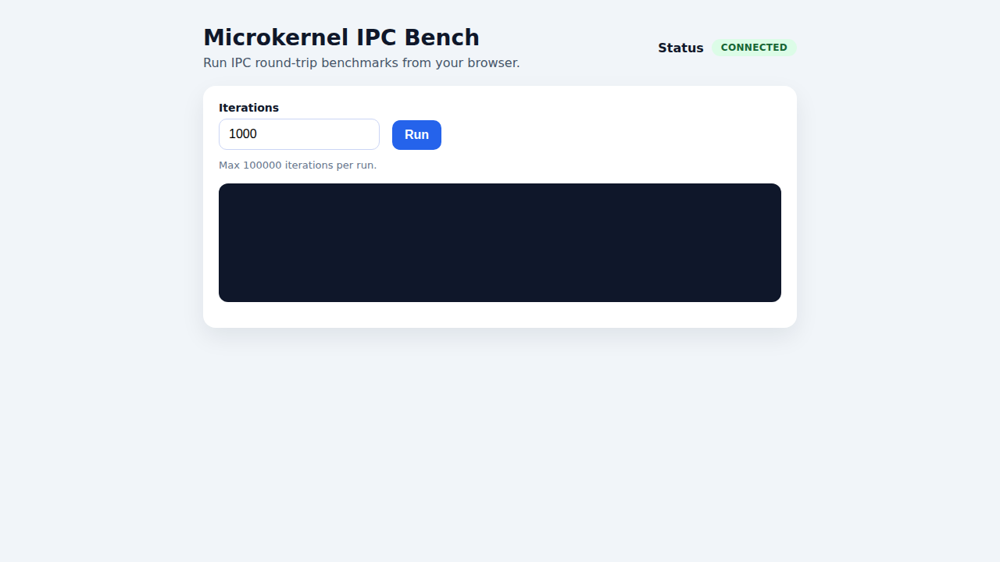

Microkernel OS — Minimal Simulation

Project Description

Design and implement a microkernel-based operating system with minimal kernel functionality and user-space services. This repo provides a working IPC router (the "kernel") plus three user-space services to demonstrate microkernel separation, message passing, fault isolation, and IPC overhead.

Structure

- docs/: project requirements and design notes
- include/: public headers for kernel and services
- src/kernel/: kernel skeleton and IPC interface
- src/services/: example user-space services (console, fs, network)
- build/: build outputs
- Makefile: build targets for kernel and services

Quick start

To build the kernel, services, and CLI tools (requires a C toolchain):

```sh
make
make tools
```

This creates binaries in `build/`. See `docs/requirements.md` for project requirements.

Run the microkernel + services:

```sh
./build/kernel > /tmp/kernel.log 2>&1 &
./build/console_service > /tmp/console.log 2>&1 &
./build/fs_service > /tmp/fs.log 2>&1 &
./build/net_service > /tmp/net.log 2>&1 &
```

Use the CLI to send IPC requests or benchmark:

```sh
./build/bench_client console "hello"
./build/bench_client fs "readme.txt"
./build/bench_client net "ping"
./build/bench_client bench 1000
./build/bench_client monolithic 1000
```

Fault isolation demo:

```sh
kill <console_service_pid>
./build/bench_client console "hello"  # reports kernel error
./build/bench_client fs "readme.txt"  # still works
./build/console_service &
```

Web GUI

There is a minimal web GUI that runs in WSL without external dependencies. It now includes a styled layout with connection status. Start the kernel and then the GUI server:

```bash
make kernel
./build/kernel > /tmp/kernel.log 2>&1 &
python3 src/gui/server.py &
# then open http://localhost:8000/ in your browser
```

Use the GUI to run IPC round-trip benchmarks and view results. Ensure the kernel and console service are running first.


